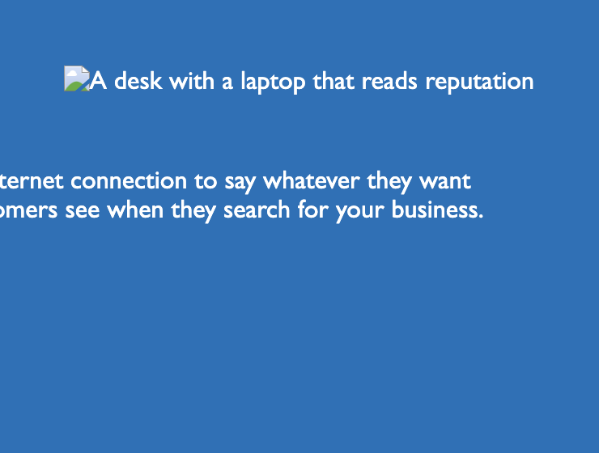

# Code Refactor

## Description

- Code Refactor is the first challenge.
- The purpose of this repository is to fix and edit the code of a previously given code.

## Usage

Navigate to the live link of this repository: 

You will notice, while webpage remains the same, some edits were made to improve accessibility shown in examples below:

-Description will show instead of image, if the image is not loaded.

-Image descriptions will be read to user if the user is using a screen reader.

## Credit
### Resources
- Pre-work Bootcamp Materials
- Bootcamp Materials
- W3 Schools
- Stack Overflow

### Applications Used
- VS Code
- Screencasify

### Thank you for visiting!